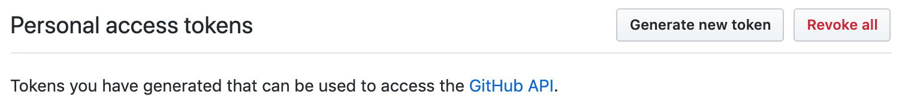
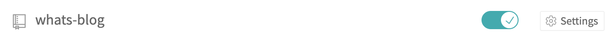
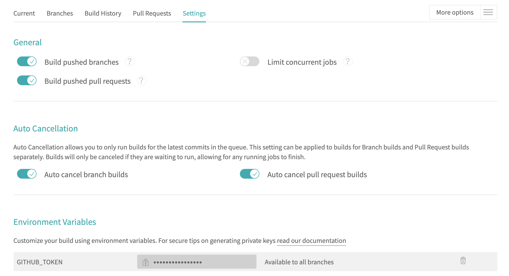

# What's Blog

## 什么是 What's Blog?

What's Blog 是一个开箱即用的静态博客系统，基于 `Hexo` 和 `Next` 构建。

## 如何使用 What's Blog?

### 1. Fork What's Blog 仓库

将 [What's Blog 仓库](https://github.com/xinpingwang/whats-blog) Fork 到个人账户下，并重命名为 ***your_github_acount_name*.github.io**

### 2. 配置自动化构建：

- 在 Github 上生成 `token`
到个人设置页面 [https://github.com/settings/tokens](https://github.com/settings/tokens) 生成一个 `token`，用户下一步的 Travis CI 配置

> token 生成后，仅当时可见，离开该页面后，将无法再看到该 token，如果忘记只能重新生成

- 配置 Travis CI
在 [Travis CI](https://travis-ci.org/) 注册一个账户，并在[设置页面](https://travis-ci.org/account/repositories) 为上面 fork 的仓库打开自动构建，

此外，还需要配置一个构建环境变量 `GITHUB_TOKEN`，值为上面生成的 `token`

### 3. 修改默认配置

项目中有两个配置文件：一个是 `Hexo` 的配置文件，另一个是 `Next` 主题的配置文件

- Hexo 配置文件 `./_config.yml`，需要修改的参数有 `title`、`author`、`url` 和 `root`
- Next 主题的配置文件 `./themes/next/_config.yml`，需要修改的参数有 `social` 下面的 `GitHub` 和 `Telegram`，如果不需要可以直接将这两行注释掉

将配置修改提交到 GitHub 之后，将触发第二步配置的自动构建，在 Travis CI 的 [Dashboard](https://travis-ci.org/dashboard) 页面可以查看构建详情，等待构建完成（大约半分钟）后，可以浏览 **https://*your_github_acount_name*.github.io** 进行查看。
